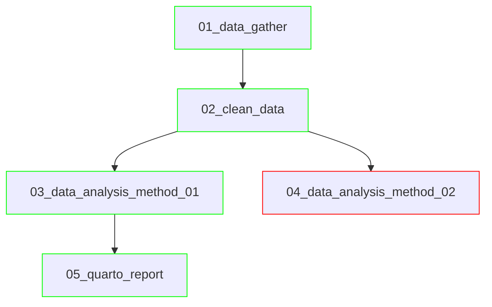

# History

This history communicates the strategy followed to obtain the end results.
It is useful for longer projects to describe how and why certain analyses
were performed, and which analyses lead to what.

## Overview

A mermaid flowchart diagram can visually describe how folders relate each other.

An example chart for a longer project:

