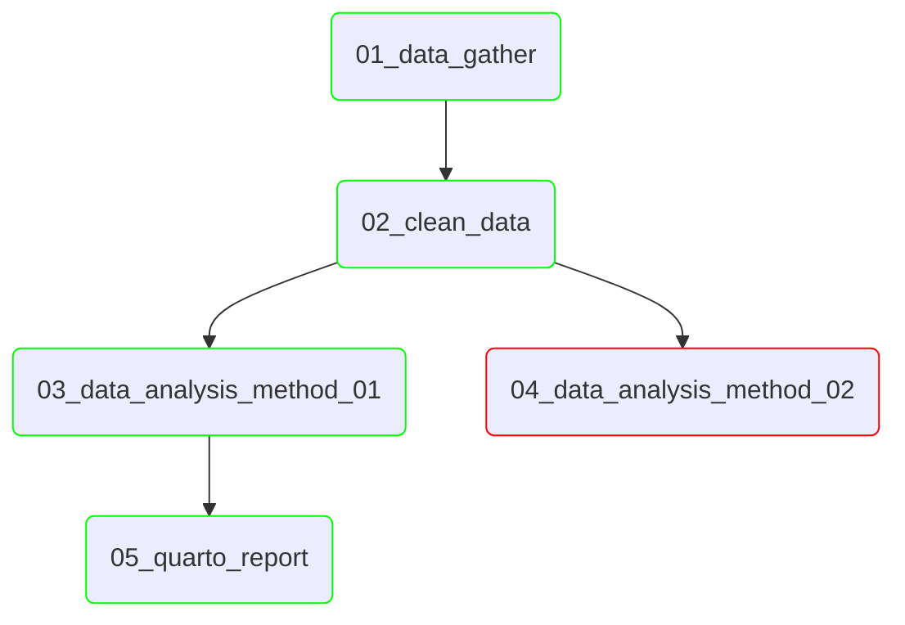

# Analyses

This folder contains numbered folders with launch scripts to run the
project's analyses. Each folder is numbered in the order it was run, and
has a short description of the analysis.

The section [History](#history) below, and its mermaid diagram, is used to
communicate how the folders relate to each other. For example:
- which folders run the same workflow but with different parameters.
- which folders run subsequent analyses to another folder.
- which folders result in useful data, were abandoned/unfinished, or the resulting 
data were of little use. 
- which folders use test data and develop workflows, and which folders run analyses on the full data sets.

```
analyses
  |
  | - README.md                             (This file, including the History section)
  |
  | - 01_fetch-source-data/                  (Standalone script fetching the example's test data)
  |     \ - fetch_source_data.sh
  |
  | - 02_workflow_dev/                       (Nextflow workflow dev against that test data)
  |     | - params.yml                       (Parameter file for test data)
  |     \ - run_nextflow.sh                  (Shell script to call nextflow with correct parameters)
  |
  \ - 03_<short_desc>/                       (Usually the workflow that runs all the data)
        | - params.yml                       (Parameter config for all data)
        | - nextflow.config
        \ - run_nextflow.sh
```

Analyses often follow this recipe, making the analyses easy to run, recreate, and reference.

```bash
pixi run <numbered-analysis-task>
```

Try it now with the shipped example: `pixi run 01-fetch-source-data` then
`pixi run 02-workflow-dev`.

Each analysis folder has a matching task in the root
[`pixi.toml`](../pixi.toml), with its `cwd` baked in, so running it
doesn't require `cd`-ing there or activating anything manually. See
[`../docs/advice/nextflow_workflow.md`](../docs/advice/nextflow_workflow.md)
for how to write `run_nextflow.sh`, `params.yml`, `nextflow.config`, and
the matching pixi task.

When a workflow script is extended to incorporate new processes / tools,
the workflow is resumed in the same analysis folder it was originally deployed to generate the next set of results.
A new analysis folder often corresponds the running of a different workflow script or an alternate parameter input to investigate.

`nextflow log` can be used to see the date and status of each time nextflow has been
run. Git tags can also be used to mark major stages of completion on the main branch.

## History

For longer projects, a mermaid flowchart diagram can visually describe how
the numbered folders above relate to each other, and communicate the
strategy followed to obtain the end results.

An example chart for a longer project:

