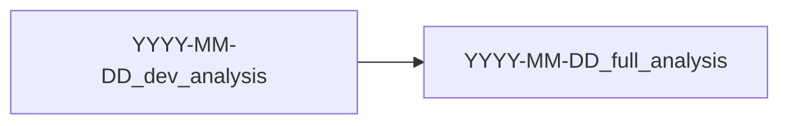

# Roadmap

This roadmap communicates the strategy followed to obtain the end results.
This is useful for longer projects to describe how and why certain analyses
were performed, and which analyses lead to what.

## Overview

Use a mermaid diagram to visually describe how folders relate each other.
`flowchart` is an example, but other types of chart can be used to display the
folder relationships.

